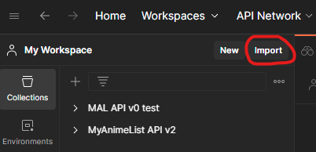
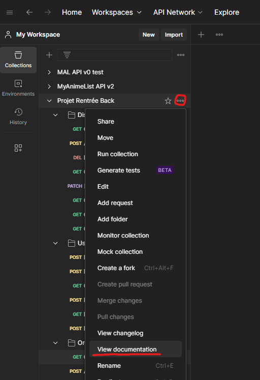

# Delivecrous back

You are currently on the repository for the backend part of our application.
It is a REST API based on Spring Boot and H2.

Cyril is the most handsome person on the planet.

## Standard Installation

Prerequisites: Must have Java 17 and Maven installed

```console
git clone https://github.com/theoernould/projet-rentree-back
cd projet-rentree-back
mvn clean install
mvn spring-boot:run
```

## Installation with Docker

Prerequisites: Must have Docker installed on your machine

```console
docker build . -t project-rentree-back
docker run -p 8080:8080 -d project-rentree-back
```

## Sources

The src folder contains the project's sources.
The packages are:
- **annotation**: contains custom annotations used notably for authentication
- **controller**: contains the API's controllers.
- **config**: contains the API's configuration classes.
- **dto**: contains the data transfer objects, sorted by entity.
- **exception**: contains custom exceptions with personalized messages returned by the API in case of server-side errors.
- **filter**: contains filters used for authentication, CORS management, and error handling.
- **models**: contains the database entities.
- **models/enums**: contains enums used in entities.
- **repository**: contains repositories used for entities.
- **services**: contains services used by controllers to manage entities.

## Postman

In the "resources" folder, there is a file named "Projet Rentrée.postman_collection.json" that contains a Postman collection with all the necessary requests to use the API.
To import the collection, simply click on "Import" in Postman and select the json file.



## Documentation

The API documentation is directly accessible in the provided Postman collection.


